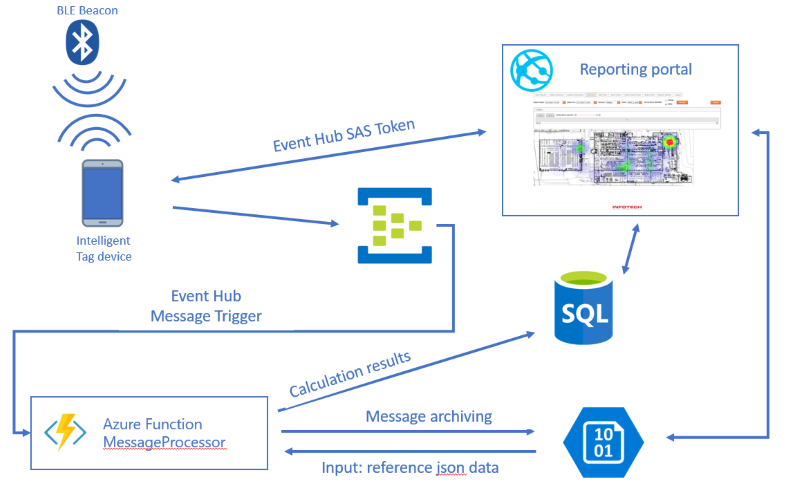
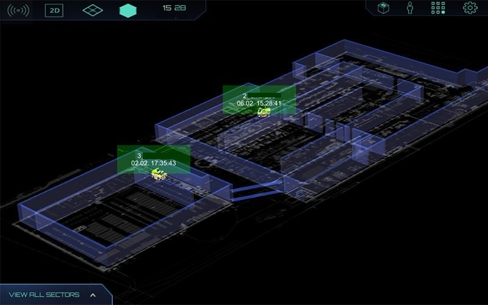
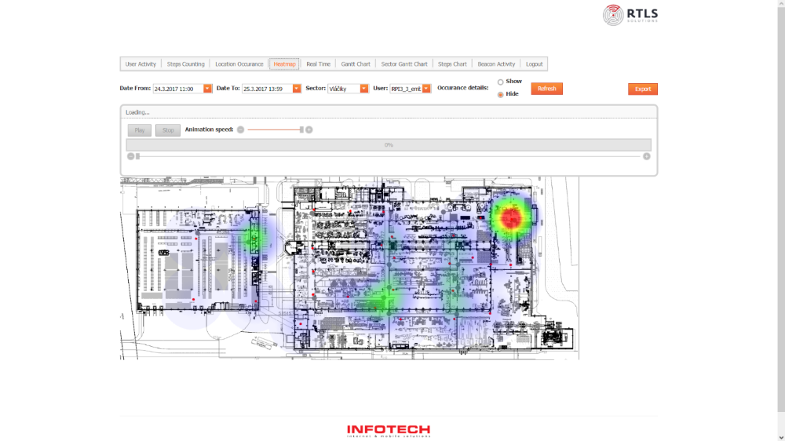

Microsoft teamed up with Infotech to bring their quickly growing Real Time Location Service (RTLS) solution into cloud and this way allow them to use scalability of the cloud. RTLS provides people and machine movement monitoring within enclosed areas or in the situations where the precision of GPS is not sufficient solution. It also includes rich visualization and reporting capabilities. Our first step was to move their local deployment to Azure infrastructure and subsequently thru series of hack fests we have built solution running on Platform services. The scope was following:

- Uploading captured BLE beacon data from devices to Azure

- Process data and compute real time location
- Store data in Azure for visualization and further processing needs
- Creating data schema which supports multi-tenant setup
- Migrate existing customer portal to Azure PaaS

# Overview:

Project was divided into four parts:

- **UWP and Android field app integration with Event Hub**: These applications are communicating with BLE beacons, they are measuring distance from these beacons (signal strength) and they are sending obtained data to Event Hub 
- **Message processing Azure Function: **This function is responsible for making trilateration calculation (calculating the location from received signal intensity) and is activated for every incoming message
- **Data Storage: **There are two types of storage, which has been used. For purpose of data visualization in user portal, we have used Azure SQL DB, where we have built multi-tenant relational schema. As a second type of storage we use Blob Storage account where we output raw data from devices, as there can arise need to recalculate historical positions, when location algorithm changes.****
- **Portal and configuration services hosted as a Web App: **scalable way for hosting reporting portal, which simplifies administration and leaves more space for development. ****

# Customer profile

[INFOTECH s.r.o.](http://infotech.sk/) is very well established software company, founded in 1999. During its existence, Infotech has cooperated with more than 100 customers while the biggest ones are Nokia, Orange, Dracik (biggest CZ/SK toy store), Leo Burnett advertising agency etc. Infotech focuses on web, desktop and mobile app development. They develop both custom SW and SW product. Currently they focus majority of resources into their Real Time Location System. This solution has potential for global scale and to target large number of customers. Main customers for this product are manufacturers with factories and warehouses, airports, hotels etc.  Currently they have 2 customers in production operation and 6 other in pilot operation for RTLS solution.

# Problem Statement

Solution had a great traction of onboarding new customers from its beginning. However, Infotech was running the solution on their own physical server, which would **not be able to support rapid increase of the number of customers and thus messages from devices, that needed to be ingested and processed**. As a first quick step we decided to utilize Azure’s infrastructure services, so there was guarantee, that there will be no lack of computational power. Another pain point, that Infotech faced was **complexity of deployment operations** when onboarding new customers, as solution did not support multi-tenancy, what means, that whole SW setup had to be replicated for every customer (standalone DB, reporting portal, mobile apps with customized endpoints). In subsequent steps, we have been working on moving solution to Azure PaaS to create multi-tenant solution which would consume Azure resources in efficient way and which would be easily scalable.

## Execution team

**Marek Lani** Technology Evangelist @ Microsoft, project responsibilities: Architecture design, Azure Backend (Event Hub, Azure Functions, UWP beacon communication)

**Jan Pospisil** Senior Technology Evangelist @ Microsoft: project responsibilities: architecture reviews

**Patrik Pasko** Senior Software Developer in Infotech, project responsibilities: Backend (Implementation of key business logic) and Data Structures (new schema, da migrations etc.)

**Michal Celeng** Senior Software Developer in Infotech, project responsibilities: client applications for tag devices (Android, UWP)

# Solution, steps and delivery

As stated before, in order to create multi-tenant, highly scalable solution which would be able to dynamically adapt its computational needs to quickly increasing number of customer of RTLS, we have created new architecture for RTLS solution, which is built purely on top of Azure Platform Services. Creation of architecture took us several brainstorming and prototyping sessions, during which we have verified our architectural designs.


*Figure 1. Brainstorming*

At the end our final architecture of RTLS version 2.0 (cloud) utilizes following Azure Services:Event Hubs (for ingesting messages), Azure functions for message processing and location calculation, Azure SQL DB to store data and Web App to Host solution's user portal. It looks as follows:



*Figure 2. Final Architecture*


## UWP and Android field app integration with Event Hub

To measure BLE Beacons signal intensity, Infotech is using Android smartphones and custom made tag devices capable of running Windows 10 IoT Core. These devices are running application which receives signal from BLE beacons and sends meta data to Azure Event Hub. Infotech is using their own BLE beacons, which were manufactured with aim to simplify the installation process (placement of the beacons) on the site and that way interrupt production process as little as possible. 


*Figure 3. Custom developed BLE beacon*

In the first version of RTLS there was PHP web application running on physical server, which was responsible for listening for POST request from the devices, which contained metadata with measured beacons signal intensity and other identification data, such as device_id, timestamp, etc. Such approach was highly limited by number of web server request threads and capacity of server and network. We have decided to replace this application for Azure Event Hub, which serves as a data entry gate to Azure. To utilize Event Hub scalability potential and to have guarantee that received messages are correctly ordered, we have decided to use Event Hubs partitioning capability. We have created 32 partitions, where company_id, which is set within the application configuration, is used as a partitioning key. We have secured communication with Event Hub using SAS token generation on the side of reporting portal, which besides of the end user interface, contains also solution administration services. Below we are stating most important code snippets which enables device communication with Event Hub.

### SAS Token generation within reporting portal

```c#
private static string createToken(string resourceUri)
{
	TimeSpan sinceEpoch = DateTime.UtcNow - new DateTime(1970, 1, 1);
	int duration = {some int};
	var expiry = Convert.ToString((int)sinceEpoch.TotalSeconds + duration);
	string stringToSign = Uri.EscapeDataString(resourceUri) + "\n" + expiry;
	
	HMACSHA256 hmac = new HMACSHA256(Encoding.UTF8.GetBytes(key));
	
	//Create hash and convert to string
	var signature = Convert.ToBase64String(hmac.ComputeHash(Encoding.UTF8.GetBytes(stringToSign)));
	
	//create SAS token using computed hash
	var sasToken = String.Format(CultureInfo.InvariantCulture, "SharedAccessSignature sr={0}&sig={1}&se={2}&skn={3}", Uri.EscapeDataString(resourceUri), Uri.EscapeDataString(signature), expiry, keyName);
	
	return sasToken;
}
```

 

### Android connecting and sending data to Event Hub

```java
public class JSONsender {
    private static final String TAG = "JSONsender";
    protected static Context context;

    public JSONsender(Context context){
        this.context = context.getApplicationContext();
    }
    public static List<WebServiceItem> sendJsonPost(String url, JsonElement data) {
        final String finalUrl = url;
        final JsonElement finalData = data;
        Log.d(TAG, finalData.toString());
        final ArrayList<WebServiceItem>[] resultArray = (ArrayList<WebServiceItem>[]) new ArrayList[1];
        HttpURLConnection httpcon;
        String result;
        try {
            //Connect
            final int connectionTimeout = 20000; //20 sec
            final int readTimeout = 20000; //20 sec
            httpcon = (HttpURLConnection) ((new URL(finalUrl).openConnection()));
            httpcon.setDoOutput(true);
            httpcon.setConnectTimeout(connectionTimeout);
            httpcon.setReadTimeout(readTimeout);
            httpcon.setRequestProperty("Content-Type", "application/json");
            httpcon.setRequestProperty("Authorization", GlobalProperties.getInstance().getAzureToken());
            httpcon.setRequestMethod("POST");
            httpcon.connect();

            //Write
            OutputStream os = httpcon.getOutputStream();
            BufferedWriter writer = new BufferedWriter(new OutputStreamWriter(os, "UTF-8"));
            writer.write(finalData.toString());
            writer.close();
            os.close();
            int code = httpcon.getResponseCode();
            if (code == 200 || code == 201 ) {
                Log.d(TAG,"success code: " + code);
            } else {
                Log.e(TAG,"error code: " + code);
            }
            //Read
            BufferedReader br = new BufferedReader(new InputStreamReader(httpcon.getInputStream(), "UTF-8"));
            String line;
            StringBuilder sb = new StringBuilder();

            while ((line = br.readLine()) != null) {
                sb.append(line);
            }

            br.close();

        } catch (IOException e) {
            e.printStackTrace();
        }

        return resultArray[0];
    }
```

### UWP IoT Core application

Originally application for field intelligent tag device was build in java for Android and in C for custom made tag device. In order to simplify development, we have developed UWP application capable of running on  Windows 10 IoT Core device. 

#### UWP BLE Beacon signal intensity reader

```c#
public sealed partial class MainPage : Page
{
	// Bluetooth Beacons
	private readonly BluetoothLEAdvertisementWatcher watcher;
	private readonly BeaconManager beaconManager;
	
	private const int rssiValidity = 10;

	public MainPage()
	{
		// Construct the Universal Bluetooth Beacon manager
		beaconManager = new BeaconManager();

		// Create & start the Bluetooth LE watcher
		watcher = new BluetoothLEAdvertisementWatcher { ScanningMode = BluetoothLEScanningMode.Passive};
		watcher.Received += WatcherOnReceived;   
		watcher.Start();
	}

	protected override async void OnNavigatedTo(NavigationEventArgs e)
	{
	   while(true)
		{
			foreach (var b in CommunicationHelper.Beacons)
			{
				if((DateTime.Now - b.UpdatedAt).Seconds > rssiValidity)
					//Remove value, and wait for the new one
					b.Distance = 0;
			}
			
			//Builds the final EventHub payload containing other metadata
			await CommunicationHelper.ReportBLESignalIntensity();
			
			//Run in two second window
			await Task.Delay(2000);
		}
	}

	private async void WatcherOnReceived(BluetoothLEAdvertisementWatcher sender, BluetoothLEAdvertisementReceivedEventArgs eventArgs)
	{
		//We need to create HEX representation of Mac Address split with ':'
		string addr = Regex.Replace(eventArgs.BluetoothAddress.ToString("X"), ".{2}", "$0:");
		addr = addr.Remove(addr.Length - 1, 1);
		var beacon = CommunicationHelper.Beacons.Where(b => b.Device == addr).FirstOrDefault();
		if (beacon != null){
			beacon.Distance = eventArgs.RawSignalStrengthInDBm; 
			beacon.UpdatedAt = DateTime.Now;
		}			
	}	
}
```

 

#### Event Hub partition data sender

```c#
private static string sasToken = null;
private static string serviceNamespace = "sbNamespace";
private static string hubName = "hubname";
private static string publisherName = "companyId";
private static int tokenValidityDuration = 60 * 60; //hour
private static int tokenLastGenerated;

public static async Task CallEventHubHttpAsync(string payload)
{
	var baseAddress = new Uri(string.Format("https://{0}.servicebus.windows.net/", serviceNamespace));
	var url = baseAddress + string.Format("{0}/publishers/{1}/messages", hubName, publisherName);

	// Create client
	var httpClient = new HttpClient();

	if (sasToken == null || !isTokenValid())
	{
      	//if token is not valid, we request new one
		sasToken = getToken(url);
		TimeSpan sinceEpoch = DateTime.UtcNow - new DateTime(1970, 1, 1);
		tokenLastGenerated = (int)sinceEpoch.TotalSeconds;
	}


	httpClient.DefaultRequestHeaders.TryAddWithoutValidation("Authorization", sasToken);

	var content = new StringContent(payload, Encoding.UTF8, "application/json");
	content.Headers.Add("ContentType", "application/json");

	var response = await httpClient.PostAsync(url, content);
}

private static bool isTokenValid()
{
	var sinceEpoch = DateTime.UtcNow - new DateTime(1970, 1, 1);
	return ((tokenLastGenerated + tokenValidityDuration) < (int)sinceEpoch.TotalSeconds);
}
```


## Message processing Azure Function

During our initial architectural designs, we thought about integrating Stream Analytics in the solution as a primary service for message processing. However, it turned out, that this service was not suitable, as we needed to run relatively difficult trilateration algorithm for every message, which computes location based on the signal intensity measures received from devices. We have ported this algorithm from PHP and decided to use Event Hub message triggered Azure Functions. This function allows us to execute more complex computational tasks on top of every message and save data to Azure SQL DB and Blob Storage for archival purposes. Character of the scenario implies, that the message flow to event hub will be continuous without any pauses. That means, that there will always be several running instances of message processing function. According to this fact, we have decided to run the function within the App Service Plan and not in dynamic/consumption mode, as it is more efficient from the economy point of view. As we have been working on this project since Azure Functions was brand new Service, we went thru creation of csx scripts project on portal, then experimenting with local development using tools for VS2015 and we ended up with tools for VS2017 and class library project, which brought us to more comfortable way of creating precompiled function packages and utilizing IntelliSense during development. When doing trilateration computation, we need to read reference data saved as blob in blob storage. This reference data contains details about BLE Beacons installation. Data is split to several blobs and as a naming convention we have used ID of company. Within payload being send to event hub, there is also companyId field, which is set for every device and is used during the message processing for referencing correct reference data blob. Function is outputting computed results to SQL DB. We have used SQLConnection to connect and write to Azure SQL database. This code is however part of private.dll containing main business logic of solution. Azure function is utilizing also blob output binding, where we forward received messages for archival needs. For naming convention of the created output blob files, we have used combination of date and companyId fields.

###  Code of the Event Hub  triggered function:

```c#
using Newtonsoft.Json;
using System;
using System.Configuration;
using System.IO;

namespace MessageProcessingFunction
{
  public class Message
  {
      public string companyGuid {get; set;}
      public List<BeaconMeasure> BeaconMeasures {get; set;}
      ...
  }
  
    public static class MessageProcessor
    {
        [FunctionName("EventHubTriggerCSharp")]
        public static void Run([EventHubTrigger("spinhub", Connection = "EventHubConnectionString")]Message myEventHubMessage, [Blob("companysetups/{companyGuid}.json", access:FileAccess.ReadWrite, Connection = "StorageAccountConnectionString")] ICloudBlob myInputBlob, TraceWriter log)
        {
            // read reference data if needed (if company with recieved guid exists and if file 			   with reference data was modified)
            
           if (!LocalEntities.Companies.ContainsKey(myEventHubMessage.CompanyGuid)
                || LocalEntities.Companies[myEventHubMessage.CompanyGuid] == null
                || cloudBlob.Properties.LastModified > LocalEntities.Companies[myEventHubMessage.CompanyGuid].LastModified)
            {
                Stream stream = new MemoryStream();
                myInputBlob.DownloadToStream(stream);
                stream.Position = 0;
                var sr = new StreamReader(stream);
                string json = sr.ReadToEnd();
                var c = JsonConvert.DeserializeObject<Company>(json);
                LocalEntities.Companies[myEventHubMessage.CompanyGuid] = new CompanySetting() { Company = c, LastModified = new DateTimeOffset(DateTime.Now) };
            }

            log.Info("Processing message");
          
          	//Do trilateration calculations and save to DB
            Core.MessageProcessor.ProcessMesssage(myEventHubMessage);
            log.Info($"C# Event Hub trigger function processed a message: {myEventHubMessage}");
        }
    }
}
```

## Data Storage

As already mentioned, there are two types of Azure data storage used within the RTLS solution. 

For purpose of system configuration and data visualization in user portal, we have used Azure SQL DB. Originally RTLS was running on top of PostgreSQL Database. Original DB schema was meant for single customer deployments, what means, that for every customer there was separate database created for every customer. As we decided to build new version of RTLS solution fully on top of platform service, we have decided to change used database technology for Azure SQL DB. The reasons to choose Azure SQL DB were several:

- Maturity level of DB technology
- No Azure PostgreSQL DB as a Platform offering when starting with migration to cloud (it is however available now)
- Simpler integration with C# web application and event hub message processing function 

When migrating to Azure SQL DB, first, we have designed new multi-tenant schema thru injecting new table to represent companies in data model. Besides creating DB schema that would support multi tenancy, we needed to secure, that we surface only data that belongs to company of the actual logged in user. First there was plan to solve this via applying Row Level Security policies to tables. We have decided to move this data filtering to application level, as complexity of schema would bring large complexity also to policies, that would need to be applied. 

In the next step, we needed to migrate existing data in the customers’ databases. As there was need for schema changes, there was no possibility to automate this process using some existing migration utilities. We needed to do this thru custom developed migration scripts, which were run on top of databases for every customer. 

 In the solution, we have used blob storage for following purposes:

-       **messages archiving: **messages are archived mainly for needs of eventual location re-computation needs in the future if there are optimization of location computation algorithm.  ****
-       **storing reference data: **this data contains configuration details needed for computation of actual position of devices within event hub message processing function. There are individual blobs created for every customer and they are re-generated every time there is change in BLE beacons setup/installation, which is stored within database.

## Reporting and monitoring portal and configuration services hosted as a Web App 

As reporting and monitoring portal is written as an ASP.NET application and configuration services are built on top WCF and neither of those two relays on any unsupported dependencies and COM objects, we decided to utilize scalability of Web App Service and its other platform features, to host these parts of solution. Every visualization is accessible to customer as a module which is activated, if customer has sufficient licensing level and of course, if the visualization is suitable for the specifics of the locating scenario. The changes needed to be implemented were related only to new multi-tenant setup, where we needed to enrich every data surfacing query with company id validation.

 

*Figure 4. Monitoring - Unity 3D live tracking model*



*Figure 5.  Reporting - heat map visualization of historic data*

On the configuration services side of the solution there was need to:

- Create SAS Token generating service, which enabled devices to communicate with event hub
- Implement “pausing service” which is responsible for idling field devices when there is ongoing BLE Beacon installation change on the customer’s site, so the devices are not sending invalid data. This service is simple and it just replies to devices’ regular check request with idle/non-idle flag.
- Implement Configuration to blob storage exporting scripts mentioned in previous section.****

# Conclusion

Azure App Service Ascend+ engagement consisted of two major parts:

## Business and technical onboarding that included:

- CEO/BDM meeting to introduce Ascend+ program and define problem and pain points to be solved within engagement
- Legal work such as a non-disclosure agreement and Technical Engagement Agreement
- Solution mapping with key developers
- IaaS workshop and solution migration
- Initial architectural brainstorming sessions

## Development

Development itself consisted from series of hack fests and subsequent “homework”, while following activities were conducted:

- Creation of general solution which demonstrated data flow pipeline from device to event hub subsequent processing with Azure Function and outputting to Azure SQL DB
- Multiple ad-hoc architectural brainstorming sessions, when we identified weak spots in existing architecture (together 3)
- Migration of existing bits of the solution (PostgreSQL -> Azure SQL, Trilateration algorithm prepared as standalone dll, utilized by Function)
- Development of message processing Azure function
- Development of administration services and deployment of portal to Azure Web App.

## Learning, findings and challenges:

- As the whole development process took several months, we had chance to closely observe quickly changing Azure functions SDK. We have started with the development using csx scripts. As the function code was relatively complex, we needed to find a way how to use Inteli Sense and namespace referencing, so we improve development experience. We solved this thru console app project and subsequent code copy to Azure portal’s functions dev environment.  Right after announcement of possibility to develop functions using Class Library Web App project (with manual twerks) we have migrated our function to class library project. We ended up the development with Azure Functions Tools for Visual Studio 2017. We perceive that the change of C# Functions development approach and migration to class library web app project as a positive step from the perspective of development experience. Moreover, as discussed within this text, it brings it’s pros also from the perspective of functions deployment, e.g. quicker creation of new instances of function, as there is no need to compile csx scripts anymore.
- Unable to use classic way of connection strings definition thru web.config used by Entity Framework. First, we were validating possibility to use SQLite DB as a storage for reference data, needed by processing function to do the location calculation. We tried to overcome thru connection string builder, so we needed to use SQLiteConnection and raw queries. We however decided to move to blob reference data.

## Next development:

Within next engagement with Infotech we plan to focus on utilization of Azure Machine Learning in message processing pipeline, respectively location computation algorithm. Especially in factories and shop floors, where there is strong electromagnetic radiation coming out from various devices in production line, the BLE signal intensity is often biased by this radiation. We plan to reduce this bias and make the location calculation more precise thru creation of learning dataset thru fingerprinting on site and subsequent training of AI model, which will be utilized during location calculation.

To sum up, within our Ascend+ engagement with Infotech, we could address several pain points, they were facing. Together we have created highly scalable solution, which will be able to support quickly growing customer base of Infotech’s Real Time Location Tracking solution.